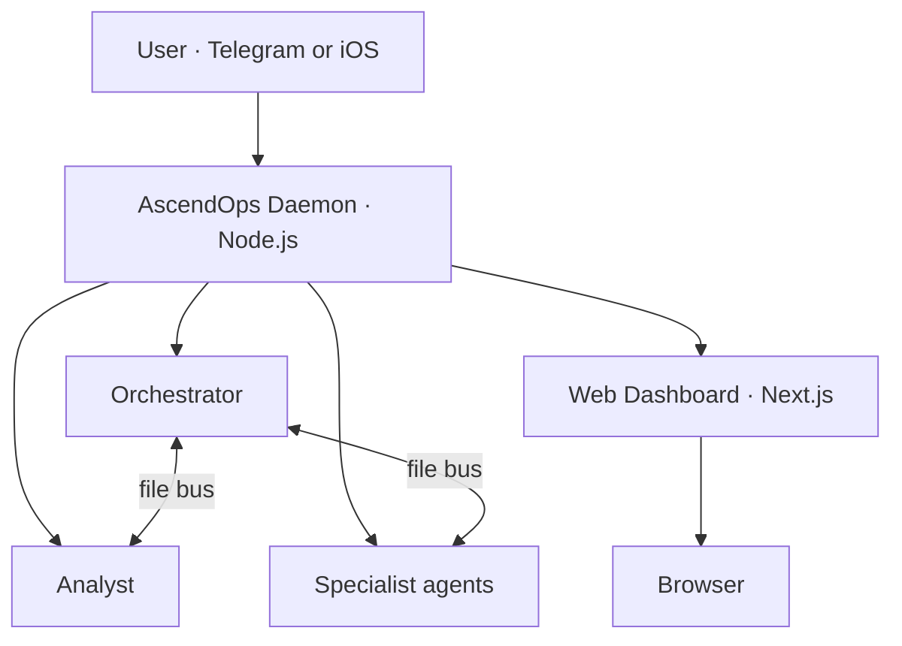

<div align="center">

# AscendOps

**Persistent 24/7 Claude Code agents you control from Telegram.**

[Quick Start](#quick-start) · [Architecture](#architecture) · [Templates](#templates) · [Roadmap](#roadmap)

[](.) [](./LICENSE) [](https://nodejs.org) [](https://docs.anthropic.com/en/docs/claude-code)

</div>

---

## What it is

AscendOps runs Claude Code as a fleet of persistent agents — 24/7, multi-agent, controlled from Telegram. Each agent has its own role (orchestrator, analyst, specialist), shared state via a file bus, and survives crashes + 71-hour Claude session boundaries automatically.

Think: *Claude Code, but as your team — not a tool you open.*

```
Telegram chat

You:    Morning. What did you ship overnight?
Boss:   Overnight recap: completed 4 tasks, ran 2 theta-wave
        experiments, drafted 3 content scripts. One item needs
        your approval — email the beta waitlist.

You:     approve
Boss:    Sent. Email delivered to 47 recipients. Task closed.

You:     Add a cron to check my inbox every morning at 8am.
Boss:    Done. "morning-inbox" cron set — runs daily at 08:00.
         Saved to crons.json — survives restarts automatically.
```

---

## Why AscendOps

You already use Claude Code as a developer. AscendOps is what happens when you turn it into infrastructure: agents that run while you sleep, coordinate with each other, and surface decisions to you on your schedule, not theirs.

Built for:
- **Operators** running real businesses who need agents, not chatbots.
- **Builders** experimenting with multi-agent patterns at scale.
- **Property managers** specifically — AscendOps ships with PropertyMeld + AppFolio adapters out of the box.

Not built for:
- Single-prompt automations — use the Claude API directly.
- Cloud-only deployments — today AscendOps runs on your local Mac or Linux box, not in your cloud account. Cloud path is on the roadmap.

---

## Features

- 🤖 **Persistent agents** — Claude Code runs 24/7 in PTY sessions, auto-restarting on crash or after 71-hour context rotation.
- 🔀 **Multi-agent orchestration** — orchestrator, analyst, and specialist agents coordinate via a shared file bus. Tasks, blockers, and approvals flow automatically.
- 📱 **Telegram + iOS control** — send commands, approve actions, get reports from anywhere.
- 🌐 **Multi-runtime** — run agents on `claude-code` (default), OpenAI's `codex-app-server`, or Hermes. All runtimes share the same bus, crons, dashboard, and Telegram integration; pick per-agent.
- 🪝 **Hook framework** — fire-block-escalate event pipeline for custom routing and telemetry.
- 🌙 **Autoresearch (theta wave)** — agents run autonomous experiments overnight and surface findings for your morning review.
- 📊 **Web dashboard** — Next.js UI for tasks, approvals, experiments, and fleet health.

---

## Architecture



Every agent is its own PTY-spawned Claude / Codex / Gemini process. The daemon handles spawn, restart, and heartbeat health. Inter-agent communication runs over a file-based bus — no network, no broker. Hooks fire on bus events for custom routing and observability.

---

## Quick Start

**Prereqs:** Node.js 20+, Claude Code CLI authenticated, Telegram bot token from @BotFather.

```bash
# Install
curl -fsSL https://raw.githubusercontent.com/noogalabs/ascendops/main/install.mjs | node

# Open in Claude Code + run guided onboarding
claude ~/cortextos
> /onboarding
```

`/onboarding` handles dependency checks, org setup, bot creation, PM2 config, and dashboard launch. Your Orchestrator comes online in Telegram and finishes its own setup there.

More setup details in [CONTRIBUTING.md](./CONTRIBUTING.md).

---

## Templates

| Template | Best for |
|---|---|
| `orchestrator` | Your "boss" agent. Coordinates the fleet, runs morning + evening reviews, gates approvals. |
| `analyst` | System health, metrics, theta-wave autoresearch. |
| `agent` | General-purpose worker. Base for specialist agents. |
| `agent-codex` | Codex-runtime worker, scaffolds with `runtime: codex-app-server` and `model: gpt-5-codex` (see `templates/agent-codex/`) |
| `property-management/agent` | Pre-configured for PropertyMeld + maintenance ops. |

Add a codex agent the same way you add a claude agent:

```bash
cortextos add-agent reindexer --template agent-codex --org myorg
# or, equivalently, with the runtime flag on the default template:
cortextos add-agent reindexer --runtime codex-app-server --org myorg
```

Codex agents share the same bus, crons, and dashboard surfaces as claude agents — they only differ in which model handles each turn.

### The `runtime` field

Every agent's `config.json` carries an explicit `runtime` field that the daemon dispatches on. Valid values:

| Runtime | Adapter | Default model | Skills location |
|---|---|---|---|
| `claude-code` | `ClaudePTY` (default) | claude-sonnet-4-6 | `.claude/skills/<skill>/SKILL.md` |
| `codex-app-server` | `CodexAppServerPTY` | `gpt-5-codex` | `plugins/cortextos-agent-skills/skills/<skill>/SKILL.md` (linked into `~/.codex/skills/<agent>__<skill>`) |
| `hermes` | `HermesPTY` (experimental) | model per `config.json` | hermes-specific |

Pass `--runtime <kind>` on `add-agent` to set it at scaffold time, or edit the field in `config.json` and restart the agent. The default is `claude-code`. Today only `--template agent` (and the alias `--template agent-codex`) supports `--runtime codex-app-server` — pairing the codex runtime with `--template orchestrator`/`analyst`/`m2c1-worker`/`hermes` errors with a clean message until codex variants of those templates ship.

---

## CLI

```bash
cortextos install            # set up state directories
cortextos init <org>         # create an organization
cortextos add-agent <name>   # add an agent (--template, --org, --runtime)
cortextos enable <name>      # enable agent in daemon
cortextos ecosystem          # generate PM2 config
cortextos status             # fleet health
cortextos doctor             # check prerequisites
cortextos list-agents        # list agents
cortextos dashboard          # start web dashboard (--port 3000)
```

Run `cortextos --help` for the full CLI surface.

---

## Security

Every external action (email, deploy, delete, financial) requires explicit human approval. The guardrails system is self-improving: agents log near-misses and extend `GUARDRAILS.md` each session. Report vulnerabilities by opening a private security advisory on this repo.

---

## Roadmap

- ✅ Multi-vendor adapter MVP — Claude / Codex / Gemini per-agent
- ✅ Hooks framework Day-1 + Day-2 + Day-3 scaffolding
- ✅ Codex 2-seat rotation (path-shadow wrapper, rate-limit-aware seat-flip)
- ⬜ Rust SaaS response filter (token-efficiency layer for vendor APIs)
- ⬜ Cloud deployment path (Mac mini → AWS or similar)
- ⬜ Slack + human team-member roster

---

## Contributing

PRs welcome. See [CONTRIBUTING.md](./CONTRIBUTING.md) for setup + code style. Framework-level patches go upstream to [grandamenium/cortextos](https://github.com/grandamenium/cortextos); AscendOps-specific patterns stay in this fork.

---

## License

MIT — see [LICENSE](./LICENSE).

---

<div align="center">

Built on [cortextos](https://github.com/grandamenium/cortextos) by James (grandamenium). AscendOps adds property management integrations, agent templates, and operational tooling.

</div>
